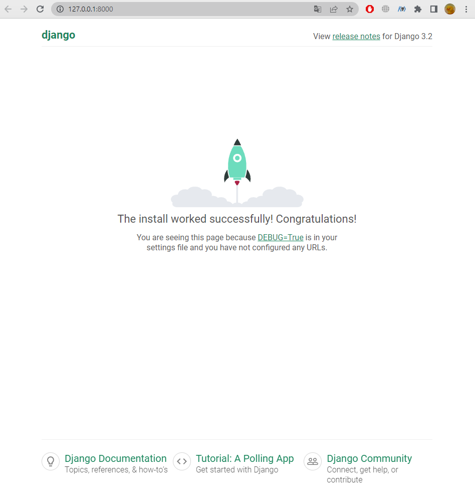

# 1. 개발 환경 설정 가이드 작성

<!-- git bash -->
1. 가상환경 생성 및 활성화
    - 가상환경 이름 : `venv`

    - venv 라는 이름은 변경 x
```
$ python -m venv venv
```
```
$ source venv/Scripts/activate
```

<br>

2. `django` 설치
    - 설치 버전 : 3.2.18 (현 LTS)
```
$ pip install django==3.2.18
```

<br>

3. 의존성 파일 `requirements.txt` 생성
    - requirements 라는 이름은 변경 x
```
$ pip freeze > requirement.text
```

<br>

4. django 프로젝트 생성
```
$ django-admin startproject firstpjt .
```

<br>

- 아래는 vscode로 진행
5. django 서버 실행
    - `반드시 vscode 내에 터미널이 켜져있지않은 상태로 진행`
    - vscode에서 `interpreter`로 가상환경을 켜 줌

    - 그 후 터미널을 새로 열면 source ~... 명령어가 돌면서 가상환경이 켜짐
    - `python manage.py runserver`를 하면 링크를 클릭해 로켓 발사 화면을 볼 수 있음 (아무것도 하지 않았을 때 보이는 화면)
    - 프로젝트 시작하고 이 화면이 안보이면 문제가 있다는 뜻


- 서버 종료 : `ctrl + c`


<br>
<br>

### # 선택사항 (git push를 하는 상황이라면)

- `!주의 : 밑의 명령어들은 git add . 을 하기 전에 실행할 것 `

- .gitignore 작성
    - [gitignore.io](https://www.toptal.com/developers/gitignore/) 활용 .gitignore 파일 생성
    - 사이트에 접속 후 입력창에 Django, Windows, macOS, VisualStudioCode 등의 단어 입력 
- git init 입력
    - git init으로 초기화 진행

<br>

### # 그 외
- `deactivate` 입력 시 가상환경을 끌 수 있음 (잘 안 씀)
- 가상환경을 공유하기 위해선 상대에게 기록지(의존성 목록)를 준다. = 가상환경 자체를 공유하지 않음
- manage.py가 있는 곳에서 서버를 켜야 활성화 할 수 있음
- 내가 만약 페어로서 파일을 받는다면 가상환경을 만든 후, `pip install -r requirement.text` 로 의존성 파일 불러오기

