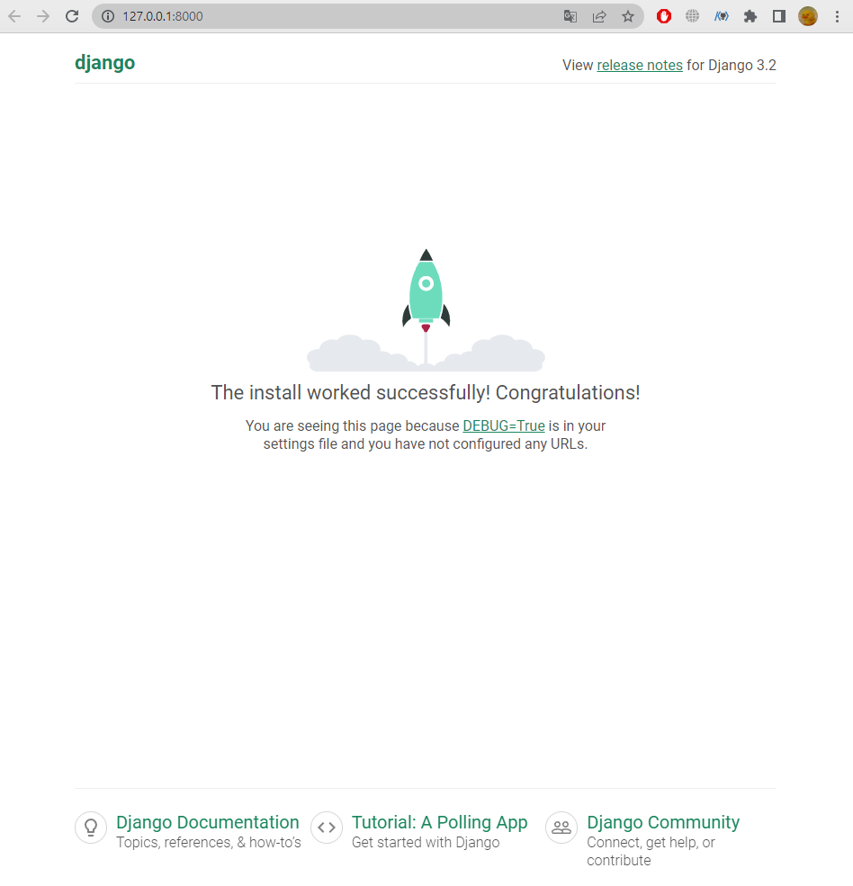

# # 개발 환경 설정 가이드 작성

## 1. 가상환경 설정

<br>

<!-- git bash -->
### 1. 가상환경 생성 및 활성화
- 가상환경 이름 : `venv`

- venv 라는 이름은 변경 x
```
$ python -m venv venv
```
```
$ source venv/Scripts/activate
```

<br>

### 2. `django` 설치
- 설치 버전 : 3.2.18 (현 LTS)
```
$ pip install django==3.2.18
```

<br>

### 3. 의존성 파일 `requirements.txt` 생성
- requirements 라는 이름은 변경 x
```
$ pip freeze > requirement.text
```

<br>

### 4. django 프로젝트 생성
```
$ django-admin startproject firstpjt .
```

<br>

- 아래는 vscode로 진행
### 5. django 서버 실행
- `반드시 vscode 내에 터미널이 켜져있지않은 상태로 진행`
- vscode에서 `interpreter`로 가상환경을 켜 줌

- 그 후 터미널을 새로 열면 source ~... 명령어가 돌면서 가상환경이 켜짐
- `python manage.py runserver`를 하면 링크를 클릭해 로켓 발사 화면을 볼 수 있음 (아무것도 하지 않았을 때 보이는 화면)
- 프로젝트 시작하고 이 화면이 안보이면 문제가 있다는 뜻


- 서버 종료 : `ctrl + c`


<br>
<br>

### # 선택사항 (git push를 하는 상황이라면)

- `!주의 : 밑의 명령어들은 git add . 을 하기 전에 실행할 것 `

- .gitignore 작성
    - [gitignore.io](https://www.toptal.com/developers/gitignore/) 활용 .gitignore 파일 생성
    - 사이트에 접속 후 입력창에 Django, Windows, macOS, VisualStudioCode 등의 단어 입력 
- git init 입력
    - git init으로 초기화 진행

<br>

### # 그 외
- `deactivate` 입력 시 가상환경을 끌 수 있음 (잘 안 씀)
- 가상환경을 공유하기 위해선 상대에게 기록지(의존성 목록)를 준다. = 가상환경 자체를 공유하지 않음
- manage.py가 있는 곳에서 서버를 켜야 활성화 할 수 있음
- 내가 만약 페어로서 파일을 받는다면 가상환경을 만든 후, `pip install -r requirement.text` 로 의존성 파일 불러오기

<br>

------------------------------------------------------------

<br>

## 2. django design pattern (요청과 응답)

### 1. 앱 생성
- 앱의 이름은 `복수형`으로 지정하는 것을 권장
```
$ python manage.py startapp articles
```

<br>

### 2. 앱 등록
- `반드시 앱을 생성한 후에 등록`해야 함
- 반대로 등록 후 생성은 불가능 (앱이 안만들어짐)
```
firstpjt 폴더 -> 
    setting.py -> 
        INSTALLED_APPS = [ ... ] 맨 위에 'articles', 를 넣어주며 앱을 등록해준다.
```

<br>
<br>

> 데이터 흐름이 코딩 순서
```
*** URLs -> View -> Template ***
```
<br>

### 3. urls.py 등록
```py
# urls.py 입장에서는 articles라는 패키지에서
# views라는 모듈을 가져와야 함

firstpjt ->
    urls.py ->
        from articles import views 추가
            -> urlpatterns = [ ... ] 에 path('articles/', views.index) 추가
```

<br>

### 4. views.py 등록
```py
# 특정 기능을 수행하는 view 함수를 만듦
# 모든 view 함수는 첫번째 인자로 요청 객체를 필수적으로 받는다.

articles ->    
    views.py -> 
        def index(request):
    return render(request, 'index.html') 추가
```

<br>

### 5. templates 폴더 생성 (템플릿 페이지 작성)
- articles 앱 폴더안에 templates 폴더 생성
- templates 폴더 안에 템플릿 페이지 작성
- `반드시 templates 폴더명이어야 하며 개발자가 직접 생성해야 함`

<br>

- django에서 template을 인식하는 경로 규칙
```
app폴더 / templates / articles / index.html

app폴더 / templates / example.html
                    
                    ↑

django는 이 지점까지 기본 경로로 인식하기 때문에 이 지점 이후의 templates 경로를 작성해야 함
```
<br>

### 6. 페이지 확인
- python manage.py runserver 입력
- 링크 창에 http://127.0.0.1:8000/articles/ 입력
- 입력 후 정상적으로 나오면 성공!
- 새로고침 하면 요청을 또 보낸 것이므로 로그에 남는 것이다.

<br>

------------------------------------------------------------

## # 3. django Model 

- `django Model` : DB의 테이블을 정의하고 데이터를 조작할 수 있는 기능들을 제공
    - 테이블 구조를 설계하는 `청사진(blueprint)`

### 1. `model 클래스 작성`
```py
class Article(models.Model):
    # 테이블 이름을 정했으니
    # 필드 이름(변수명) / 데이터 타입(모델 필드 클래스) / 제약 조건 (모델 필드 클래스의 키워드 인자)
    title = models.CharField(max_length=10)
    content = models.TextField()

--------------------------------------------------

- id 필드는 자동 생성된다.

- CharField : 길이제한을 줘야하는 것들

- TextField : 길이 제한 x

- max_length : Required, 즉 필수 인자. 안쓰면 에러남

- max_length=10 에서 길이 제한을 걸어놨기 때문에 10자를 초과하려해도 자동으로 입력되지 않음. 장고에서 막음

- CharField에 max_length써도 상관은 없는데 써봤자 아무런 변화x. 쓸모없음

```

<br>

### 2. `Migrations`
- model 클래스의 변경사항 (필드 생성, 추가 수정 등)을 DB에 최종 반영하는 방법

- Migrations 핵심 명령어
```
$ python manage.py makemigrations

> model class를 기반으로 설계도(migration) 작성
```
```
$ python manage.py migrate

> 만들어진 설계도를 DB에 전달하여 반영
```

- migrate 후 DB 내에 생성된 테이블 확인

- 이미 생성된 테이블에 필드를 `추가`해야 한다면?
    - 추가할 필드를 테이블에 추가하고 위와 같이 makemigrations와 migrate를 입력해주면 된다.

    - 만약 makemigrations를 입력하고 필드의 기본 값 설정이 필요하다는 문구가 나올 경우
```md
1) 직접 기본 값을 입력하는 방법

2) 현재 대화에서 나간 후 models.py에 기본 값 관련 설정을 하는 방법

--------------------------------------------------

- 만약 추가한 데이터 타입이 문자열 형태라면 default를 직접 넣는 1번이 나음

- 날짜 테이터는 직접 입력하기 보다 django가 제안하는 기본 값을 사용하는 것을 권장

- 2번 선택 후 `아무것도 입력하지 않고 enter`를 누르면 django가 제안하는 기본값으로 설정됨. (timezone.now)
```
- migrations 과정 종료 후 2번째 migration 파일이 생성됨을 확인

- django는 설계도를 쌓아두면서 추후 문제가 생겼을 시 복구용으로 사용할 수 있도록 함 (like `git commit`)

- `migrations 후 잊지 말고 migrate 해주기`

- migrate 후 필드가 추가 됐는지 확인

<br>
<br>

### 3. `Admin site`
- django는 추가 설치 및 설정 없이 자동으로 관리자 인터페이스를 제공 -> `데이터 관련 테스트 및 확인을 하기에 매우 유용`

- admin 계정 생성
```
$ python manage.py createsuperuser

- 이메일은 선택사항이기 때문에 입력하지 않고 진행 가능

- 비밀번호 생성 시 보안상 터미널에 출력되지 않으니 무시하고 입력을 이어가도록 함

- 다 입력하고 y 입력 -> Superuser created successfully. 뜨면 성공
```
- 이 과정을 거치면 이제 admin 사이트에 로그인 가능

<br>

- admin에 모델 클래스 등록
    - `admin.py에 등록하지 않으면 admin site에서 확인할 수 없음`
```py
# articles/admin.py

from django.contrib import admin
from .models import Article # 추가

# 우리가 만든 Article 클래스를 등록
# 암기 꿀팁 : 'admin site에 등록(register) 하겠다'
admin.site.register(Article) # 추가
```
- 위 내용 등록하고 admin사이트가서 articles 내용 CRUD 가능.

- 만약 title 적는다면 아까 적어놓은 길이 제한 때문에 10자를 초과하려해도 자동으로 입력되지 않음.

- 데이터 CRUD 테스트를 하며 우리 모델에 문제가 없다는 것을 확인할 수 있다

- 그리고 db 파일에서도 우리가 입력한 데이터들이 실제 테이블에 저장된다는 것을 확인할 수 있다

<br>

#### # 데이터베이스 초기화
1. migration 파일 삭제

2. db.sqlite3 파일 삭제

- `migrations 폴더는 지우지 않도록 주의!!`
